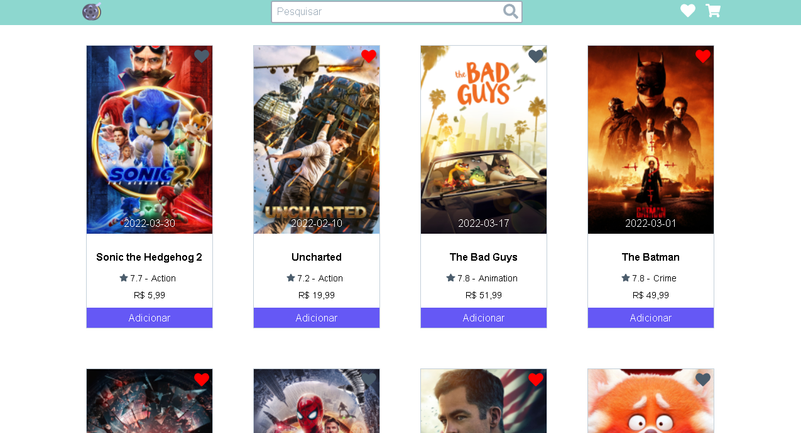

# MOVIE STORE

Uma loja de filmes com os melhores e maiores sucesos da atualidade onde você compra e assiste do conforto da sua casa.

## Tabela de conteúdo

- [Overview](#overview)
  - [O Desafio](#the-challenge)
  - [Screenshot](#screenshot)
  - [Links](#links)
- [Meu processo](#my-process)
  - [Criado com](#built-with)
  - [O que eu aprendi](#what-i-learned)
  - [Desenvolvimento continuo](#continued-development)
- [Autor](#author)
- [Agradecimentos](#acknowledgments)

## Overview

Essa é uma loja de filmes online, onde o cliente tem acesso ao catálogo logo na página inicial, com os filmes com a maior bilheteria do momento. O layout foi baseado no layout do teste de Frontend Pleno da DOT, apesar da aplicação ser para Front Junior.

### O Desafio

Os visitantes do site devem ser capazes de:

- Ver os 20 filmes com a maior bilheteria mundial atualmente.
- Pesquisar por filmes conforme digitado na barra de pesquisa.
- Ver o ícone de loading no fim da página.
- Ter efeitos visuais ao passar o mouse sobre cada filme, botões e ícones.
- Ver a responsividade do website em qualquer dispositivo móvel.
- Dar like e deslike em cada filme conforme preferência.

### Screenshot

### Links

- Live Site URL: [https://movie-store-phi.vercel.app/](https://movie-store-phi.vercel.app/)

## Meu processo

O projeto foi criado em React.js, pois teve a aprovação da DOT para ser feito mesmo o projeto sendo pedido em Vue.js, o processo de criação foi relativamente simples pois trata-se apenas de um layout, como pedido no desafio proposto pela DOT para Frontend Junior, porém tenho a pretensão de torná-lo um projeto maior e com as funcionalidades completas, como proposto no desafio de Frontend Pleno.

### Criado com

- [React](https://reactjs.org/) - Biblioteca de JavaScript
- [Styled Components](https://styled-components.com/) - Para estilos
- [TMDB API](https://www.themoviedb.org/?language=pt-BR) - API de dados

### O que aprendi

Esse projeto relata e trás a realidade a rotina de muitos desenvolvedores, pois isso aprendi ainda mais como consultar uma API com React e fazer o tratamento desses dados.

### Desenvolvimento contínuo

Mesmo após a avaliação do projeto pela DOT pretendo ainda continuar desenvolvendo o projeto transformando ele em algo escalável e com muito mais funcionalidades.

## Autor

- GitHub - [Jhonattasilva2](https://github.com/Jhonattasilva2)
- Linkedin - [Jhonatta Silva](https://www.linkedin.com/in/jhonatta-silva-dev/)

## Agradecimentos

Gostaria de agradecer a DOT pela oportunidade de criar este projeto com a oportunidade de uma vaga de Frontend Júnior mesmo com uma tecnologia diferente da pedida no desafio.
 

 # Getting Started with Create React App

This project was bootstrapped with [Create React App](https://github.com/facebook/create-react-app).

## Available Scripts

In the project directory, you can run:

### `npm start`

Runs the app in the development mode.\
Open [http://localhost:3000](http://localhost:3000) to view it in your browser.

The page will reload when you make changes.\
You may also see any lint errors in the console.

### `npm test`

Launches the test runner in the interactive watch mode.\
See the section about [running tests](https://facebook.github.io/create-react-app/docs/running-tests) for more information.

### `npm run build`

Builds the app for production to the `build` folder.\
It correctly bundles React in production mode and optimizes the build for the best performance.

The build is minified and the filenames include the hashes.\
Your app is ready to be deployed!

See the section about [deployment](https://facebook.github.io/create-react-app/docs/deployment) for more information.

### `npm run eject`

**Note: this is a one-way operation. Once you `eject`, you can't go back!**